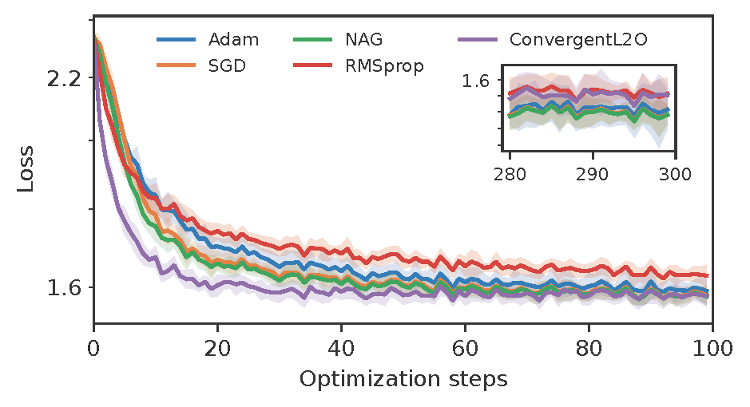

# Learning to optimize with convergence guarantees

PyTorch implementation of the code to reproduce the numerical experiments included in the manuscript "Learning to optimize with convergence guarantees using nonlinear system theory"

## Examples: 
Learning to optimize a shallow neural network for image classification with the MNIST dataset. The figures below compare the performance of our learnt optimizer with standard neural network training algorithms (Adam, NAG, RMSprop, SGD), whose hyperparameters are tuned through gridding.

  

 

The table below compares the average test accuracy achieved by standard optimizers, a learned LSTM optimizer, and our Convergent L20 method after $t=20$ and $t=300$ optimization steps, respectively.

  

 

While the performance of the learned LSTM optimizer and our ConvergentL2O method are comparable, by observing the average norm of the updates, we observe that the LSTM updates do not vanish over time, causing the parameters of the image classifier to diverge.

 

## License
This work is licensed under a
[Creative Commons Attribution 4.0 International License][cc-by].

[![CC BY 4.0][cc-by-image]][cc-by] 

[cc-by]: http://creativecommons.org/licenses/by/4.0/
[cc-by-image]: https://i.creativecommons.org/l/by/4.0/88x31.png
[cc-by-shield]: https://img.shields.io/badge/License-CC%20BY%204.0-lightgrey.svg

## References
[[1]](https://arxiv.org/abs/2403.09389) Andrea Martin and Luca Furieri.
"Learning to optimize with convergence guarantees using nonlinear system theory"
arXiv:2403.09389, 2024.
